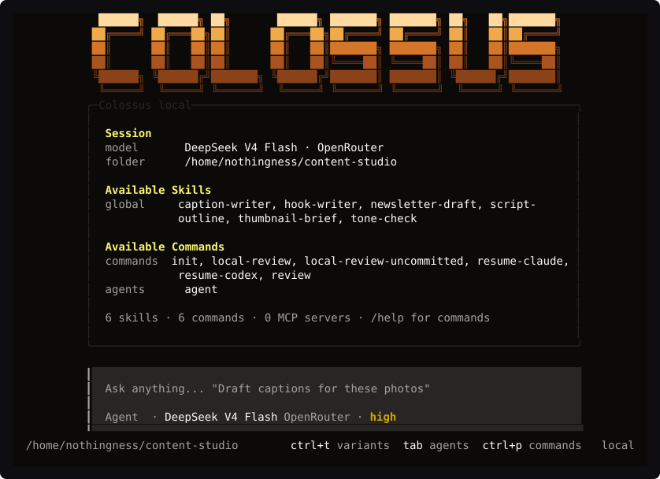
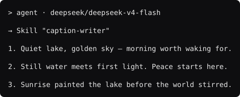

# Colossus

A local terminal agent for creative work — writing, captions, scripts, research, drafting.

<p align="center">
  
</p>

Colossus is a fork of [Kilo Code](https://github.com/Kilo-Org/kilocode) with the coding
personas and the model-specific coding prompts taken out. What is left is the runtime:
skills, slash commands, custom agents, MCP servers, and a permission system that asks
before it acts. You point it at a folder and it works on the files there.

It runs on your machine and talks to one provider you choose. There is no Colossus
account, no telemetry added by this fork, and no hosted service.

---

## Setup

### Requirements

| | |
|---|---|
| **Bun** | 1.3.14 or newer — this is the runtime, it is not optional |
| **Git** | to clone |
| **An OpenRouter API key** | or any other provider Kilo supports |
| **Disk space** | about **2 GB** — see [Why the install is large](#why-the-install-is-large) |

### Windows

`install.ps1` does the whole setup in one pass: finds a new enough Bun, installs the
dependencies, seeds your config, stores the API key, registers a `colossus` command, and
verifies the result.

```powershell
git clone https://github.com/riddhimaaan/colossus-agent.git
cd colossus-agent
.\install.ps1
```

It prompts for a key from [openrouter.ai/keys](https://openrouter.ai/keys), with the input
hidden. When it finishes, open a new PowerShell window, `cd` to the folder you want to work
in, and run `colossus`.

The installer is safe to re-run. It keeps an existing key, and rewrites its own marked block
in your PowerShell profile rather than appending a second copy.

<details>
<summary>Installer options</summary>

| Flag | Effect |
|---|---|
| `-ApiKey <key>` | Supply the key without the prompt. It lands in your shell history, so prefer the prompt. |
| `-InstallBun` | Install Bun from bun.sh automatically when it is missing or too old |
| `-SkipInstall` | Skip `bun install` — for re-registering the command or changing only the key |
| `-SkipProfile` | Leave the PowerShell profile untouched |

</details>

**If PowerShell refuses to run the script**, your execution policy is blocking local
scripts. Either allow them:

```powershell
Set-ExecutionPolicy -Scope CurrentUser RemoteSigned
```

or run the installer once without changing anything permanently:

```powershell
powershell -ExecutionPolicy Bypass -File .\install.ps1
```

**If you downloaded a ZIP instead of cloning**, Windows tags the files as web content and
blocks them even under `RemoteSigned`. Clear the tag first:

```powershell
Get-ChildItem -Recurse *.ps1 | Unblock-File
```

### macOS / Linux

**1. Install Bun**

```bash
curl -fsSL https://bun.sh/install | bash
```

Close and reopen the terminal, then check it worked with `bun --version`.

**2. Clone and install**

```bash
git clone https://github.com/riddhimaaan/colossus-agent.git
cd colossus-agent
bun install
```

`bun install` downloads the dependencies. It takes several minutes the first time.

**3. Add your API key**

Get a key from [openrouter.ai/keys](https://openrouter.ai/keys), then save it where
Colossus looks for it:

```bash
mkdir -p ~/.config/colossus
printf '%s' 'YOUR-KEY-HERE' > ~/.config/colossus/openrouter-api-key
chmod 600 ~/.config/colossus/openrouter-api-key
```

The key file stays outside this repository. Nothing in the setup ever commits it.

**4. Put `colossus` on your PATH**

```bash
mkdir -p ~/.local/bin && ln -sf "$PWD/colossus" ~/.local/bin/colossus
```

If `colossus` is still not found afterwards, `~/.local/bin` is not on your PATH. Add it
to your shell config (`~/.zshrc`, `~/.bashrc`, or `~/.config/fish/config.fish`).

**5. Check it works**

```bash
colossus doctor
```

This confirms the API key is accepted. It never prints the key. Then start it from
whatever folder you want to work in:

```bash
cd ~/my-content
colossus
```

---

## Platform support

| Platform | Status |
|---|---|
| **Linux** | Developed and tested here |
| **Windows native** | Tested on Windows 11 (PowerShell 5.1, Bun 1.3.14). Use `install.ps1` |
| **macOS** | Same launcher, same shell — expected to work, not yet verified by the maintainer |
| **Windows via WSL2** | Works; follow the Linux instructions inside WSL. Native is no longer the worse option |

On native Windows the whole TUI runs on prebuilt Windows binaries — `@opentui/core-win32-x64`
for rendering and `@lydell/node-pty-win32-x64` (ConPTY) for the terminal — so nothing needs
to compile at install time.

If you run Colossus on macOS, please open an issue saying whether it worked. That is the
fastest way to get that row changed to something firmer.

---

## Using it

Start Colossus in a folder and type what you want. It reads and searches that folder
freely; anything else — writing a file, running a command, reaching the network — it
asks about first.

When a skill matches the request, it loads that skill and says so:

<p align="center">
  
</p>

Useful commands:

| Command | What it does |
|---|---|
| `colossus` | Start in the current folder |
| `colossus run "..."` | One-shot: answer and exit, no interactive session |
| `colossus doctor` | Check that the API key works |
| `colossus prompt show` | Print the entire built-in prompt |
| `/help` | List slash commands, inside a session |

### Prompt transparency

`colossus prompt show` prints the complete operating prompt, in full, with no truncation.
On top of it the runtime adds only: the selected model, the current folder, the date, the
enabled tools, your skill descriptions, instructions from connected MCP servers, the
active agent's prompt, and the context for the request you just made. Nothing else is
injected.

---

## Configuration

Your settings live in `~/.config/colossus/` — on Windows,
`%USERPROFILE%\.config\colossus\` — outside this repository, so updating Colossus never
touches them. The launcher creates the folder and seeds a starter `kilo.jsonc` and
`AGENTS.md` on first run, and never overwrites either afterwards.

```
~/.config/colossus/
├── kilo.jsonc                    model, permissions, MCP servers
├── AGENTS.md                     standing instructions for every session
├── skills/<name>/SKILL.md        always-available skills
├── command/<name>.md             slash commands
└── agent/<name>.md               custom agents
```

Set `COLOSSUS_CONFIG_DIR` to keep it somewhere else.

**Per-folder settings.** Skills under `<your-folder>/.kilo/skills/<name>/SKILL.md` load
only in that folder and override a global skill of the same name. Good for a per-client
or per-project voice.

**Watch out:** every `.md` file in `command/` and `agent/` is loaded, so keep notes and
drafts out of those two folders. `skills/` only ever reads `SKILL.md`.

### Choosing a model

Edit `model` in `~/.config/colossus/kilo.jsonc`. Any OpenRouter model ID works, prefixed
with `openrouter/`:

```jsonc
"model": "openrouter/anthropic/claude-sonnet-4.5"
```

Check a model is available to your key before committing to it:

```bash
colossus doctor model anthropic/claude-sonnet-4.5
```

### MCP servers

MCP servers work exactly as they do in Kilo. Add them to `kilo.jsonc`:

```jsonc
"mcp": {
  "filesystem": {
    "type": "local",
    "command": ["npx", "-y", "@modelcontextprotocol/server-filesystem", "/path/to/dir"]
  }
}
```

Their tools appear in the session and are governed by the same permission rules as
everything else.

### Permissions

The starter profile is deliberately cautious:

```jsonc
"permission": {
  "*": "ask",        // everything asks first
  "read": "allow",   // except reading and searching local files
  "grep": "allow",
  "glob": "allow",
  "list": "allow",
  "skill": "allow"
}
```

Loosen it if the prompts get tiring — but `"*": "allow"` means the agent can run commands
and edit files without asking, so change it knowingly.

---

## Troubleshooting

**`colossus: command not found`** — the PATH step did not take. On macOS/Linux check that
`~/.local/bin` is on your PATH. On Windows re-run `.\install.ps1 -SkipInstall`, which
rewrites the profile entry with an absolute path, then open a new terminal.

**Windows: `The term 'colossus' is not recognized`, or it points somewhere wrong** — older
setup instructions built the profile entry from `$PWD`, so running them from outside the
checkout baked in a path that does not exist. `.\install.ps1` now derives the path from its
own location and strips any stale hand-written definition. Check what you have with
`Select-String colossus $PROFILE`.

**`Colossus needs Bun, but it was not found`** — reopen your terminal after installing
Bun, or point the launcher at it directly.

**Windows: `Bun x.y.z is older than the 1.3.14 this repository pins`** — you have more than
one Bun and an older one comes first on PATH, usually an npm-installed `bun` shim shadowing
`~\.bun\bin\bun.exe`. The launcher picks the newest one it can find and warns; to silence it,
`npm uninstall -g bun` or move `%USERPROFILE%\.bun\bin` ahead of `%APPDATA%\npm` in PATH.

**`OpenRouter: rejected the configured API key`** — the key is wrong, revoked, or out of
credit. An `OPENROUTER_API_KEY` already exported in your shell is ignored when the key
file exists; the file wins. On Windows, also suspect the file's bytes: `Set-Content` writes
in the ANSI codepage and some hosts add a BOM, either of which corrupts the key. `install.ps1`
writes it BOM-free; to fix one by hand use
`[IO.File]::WriteAllText("$env:USERPROFILE\.config\colossus\openrouter-api-key", 'sk-or-...')`.

**Windows: `doctor` cannot see a key you just wrote** — check where it actually landed.
Before the fix in `colossus.ps1`, the launcher leaked its `HOME` and `USERPROFILE` remapping
into the calling shell, so a later `"$env:USERPROFILE\.config\colossus\..."` in that same
window resolved inside `.runtime` instead of your profile. Update, then use a new terminal.

**The panel says `0 skills`** — that is correct on a fresh install. `~/.config/colossus/skills/`
starts empty. Add a folder with a `SKILL.md` in it and restart.

### Why the install is large

A clean clone is about 70 MB and `bun install` brings `node_modules` to roughly 1.8 GB,
measured on Linux.

That is large for a terminal app, and it is what is left after trimming. Colossus began as
a fork of the whole Kilo monorepo; the twelve packages it never imports — the VS Code
extension, the JetBrains plugin, Kilo's docs site and web console, and eight smaller ones
— have been removed, which took the tracked file count from 9,139 to 5,365 and the install
from 2.6 GB to 1.8 GB.

The remaining bulk is shared dependencies that the CLI genuinely pulls in, so getting much
below this would mean replacing libraries rather than deleting packages.

---

## Development

```bash
bun run --cwd packages/opencode test    # each test file in its own process
bun run typecheck                       # from the repository root
```

Do not reach for `bun test` across the suite yourself. The tests share global state and
contaminate each other when run in one process, which produces hundreds of phantom
failures. The `test` script above wraps `script/test-runner.ts`, which isolates each
file; that is the only run whose result means anything.

One test file, `test/session/llm-native-recorded.test.ts`, currently fails. Its recorded
HTTP fixtures contain the pre-fork system prompt and need re-recording against live
provider APIs. Everything else passes.

The inherited Kilo CI workflows are parked in `.github/workflows/disabled/`. They target
Kilo's own infrastructure and secrets and will not work here.

### Regenerating the screenshots

The images in this README are not mockups. They are real terminal output, captured through
a pty and replayed into SVG by `script/ansi2svg.ts`:

```bash
COLORTERM=truecolor script -qec "stty cols 96 rows 32; ./colossus" /dev/null > frame.ansi
bun script/ansi2svg.ts frame.ansi docs/images/startup.svg 96 32
```

Pass `--no-alt` for ordinary command output, which does not use the alternate screen. The
skills shown in the startup image come from a throwaway profile made for the picture; a
real install starts with none.

---

## Credits and licence

Colossus is a fork of **[Kilo Code](https://github.com/Kilo-Org/kilocode)**, which is
itself built on **[opencode](https://github.com/sst/opencode)**. Essentially all of the
engineering here is theirs. This fork removes the coding personas, adds a creative
operating prompt, and rebrands the CLI.

MIT licensed — see [LICENSE](LICENSE). The Kilo Code and opencode copyright notices are
retained, as the licence requires.

This project is not affiliated with, endorsed by, or supported by Kilo Code or opencode.
Please do not take Colossus problems to their issue trackers.
